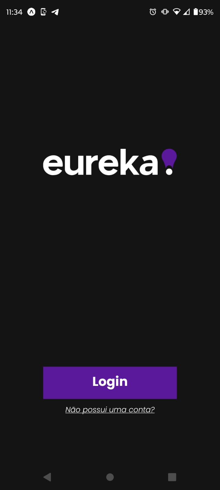
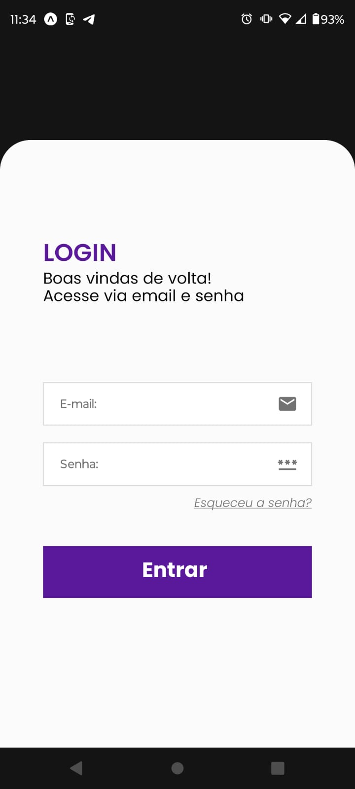
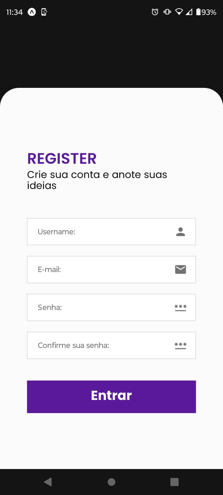
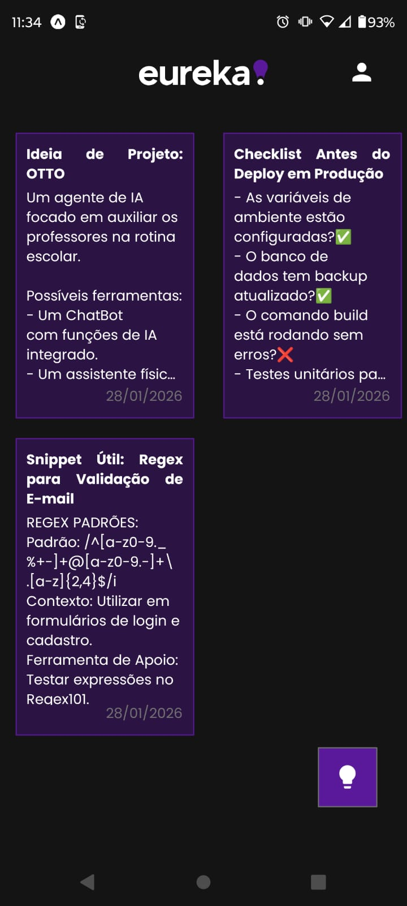
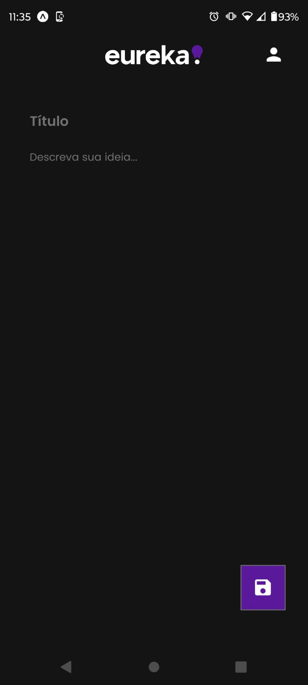
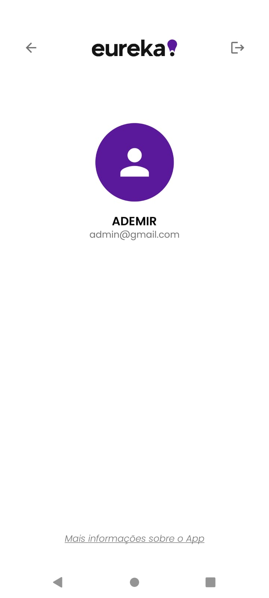

#  Eureka 💡

**Eureka** é um aplicativo mobile desenvolvido em **React Native**, utilizando **Expo** e **TypeScript**, criado durante o **Curso Técnico de Desenvolvimento de Sistemas** na **Etec de Hortolândia**, nas disciplinas de **Programação Mobile I e II**.

O aplicativo tem como objetivo oferecer um **ambiente simples, seguro e organizado** para anotações tecnológicas, como ideias de projetos, soluções de problemas, códigos (ex: REGEX, snippets) e informações úteis para desenvolvedores.

---

## 📌 Informações Gerais

- **Nome do projeto:** Eureka
- **Tipo:** Aplicativo Mobile
- **Plataforma:** Android / iOS
- **Contexto:** Projeto Acadêmico
- **Instituição:** Etec de Hortolândia
- **Ano:** 2024-2025 

---

## 🎯 Objetivo do Projeto

O Eureka foi desenvolvido com o propósito de:

- Centralizar **anotações técnicas** em um único lugar
- Garantir **segurança e privacidade** dos dados do usuário
- Aplicar conceitos modernos de **desenvolvimento mobile**
- Consolidar conhecimentos práticos em **React Native e Firebase**

O foco do projeto foi unir **funcionalidade, organização de código e boas práticas**, simulando um cenário real de aplicação profissional.

---

## 🚀 Funcionalidades Principais

### 🔐 Autenticação de Usuários
- Login e registro com **email, senha e username**
- Implementação utilizando **Firebase Authentication**

### 🔒 Persistência de Sessão e Proteção de Rotas
- Manutenção do usuário autenticado
- Restrição de acesso a rotas privadas
- Controle de navegação por layout (rotas públicas e privadas)

### 📝 CRUD de Ideias
- Criação e listagem de ideias
- Ideias vinculadas ao **usuário autenticado**
- Exibição em **cards reutilizáveis**, organizados em **duas colunas**
- Integração com **Firebase Firestore**
- Atualização em tempo real utilizando `onSnapshot`

### 🖥️ Interface do Aplicativo
O aplicativo conta com as seguintes telas:
- Tela de apresentação
- Login
- Registro
- Home (listagem de ideias)
- Criação de anotações
- Perfil do usuário

---

## 📱 Telas do Aplicativo

    
 
    

---

## 🧠 Tecnologias e Boas Práticas

### 🛠️ Tecnologias Utilizadas

  
  
  

- **React Native**
- **Expo**
- **Expo Router**
- **Firebase Authentication**
- **Firebase Firestore**
- **TypeScript**
- **Context API**
- **Hooks**
- **Fontes customizadas (Poppins)**

---

### 📂 Estrutura e Organização

- Separação de rotas **públicas (auth)** e **privadas (tabs)**
- Serviços isolados:
  - `auth.ts`
  - `user.ts`
  - `ideas.ts`
- Componentes reutilizáveis
- Layouts controlando acesso às rotas

---

### ✅ Boas Práticas Aplicadas

- Separação entre **lógica e interface**
- Uso de **Context API** para estado global de autenticação
- Proteção de rotas por layout
- Uso do **UID do usuário** como chave no Firestore
- Listener em tempo real com `onSnapshot`
- Unsubscribe do listener para evitar **memory leaks**
- Tipagem explícita com TypeScript

---

## 📚 Considerações Finais

O projeto **Eureka** representa a consolidação de conhecimentos em desenvolvimento mobile, autenticação, banco de dados em tempo real e arquitetura de aplicações.

A aplicação foi construída com foco em **organização,**
